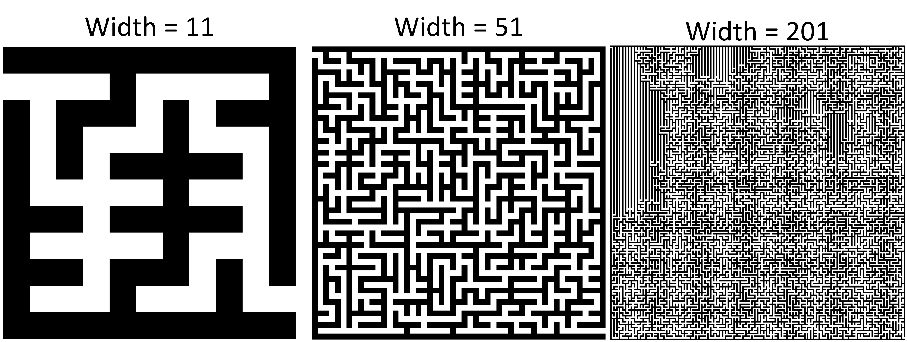
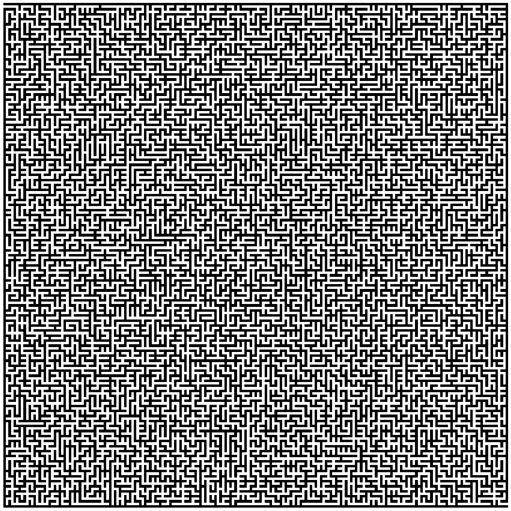
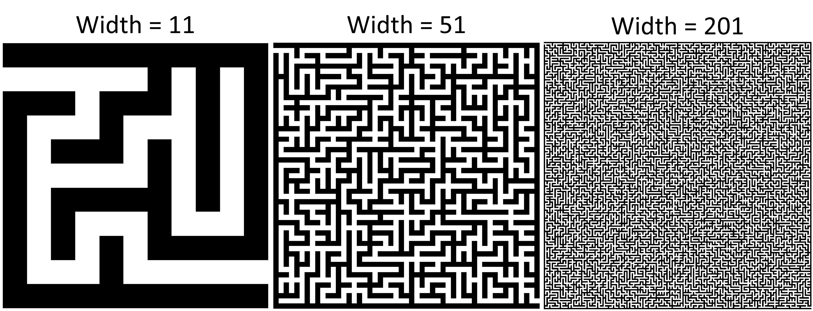
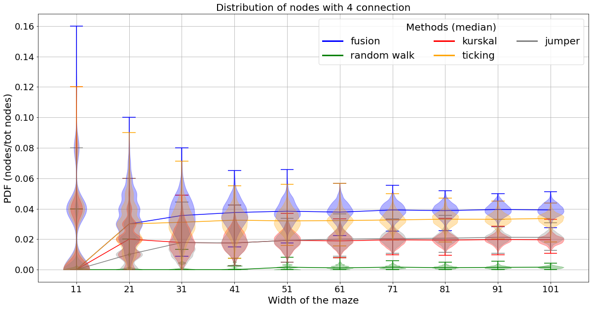

# Automatic-generation-and-resolution-of-2d-maze
Python code write in spyder IDE to generate and solve automatically 2 dimensions mazes.

The list of script and their purpose:

  - maze_generators.py:
    This script contain the functions to generate a maze as a 2d numpy array. The functions stored are:
      - create_maze_base: generate the basis that will be used by the first method to generate automatically a maze with the function maze_formation.
      - create_maze_base_boolean: generate the basis that will be used by the second method to generate automatically a maze with the function make_maze_exhaustif.
      - maze_formation: function to generate automatically a maze, take in input the output of the function create_maze_base. It will randomly draw 2 indices between 1 and len(base)-2, then if it is a wall it break it by putting a 0 and the newly 2 conected ground node are set at min([cell1, cell2]). It continue until all the ground, starting and ending nodes are not connected together.
      - make_maze_exhaustif: function to generate automatically a maze. It take in input the output of the function create_maze_base_bool. It randomly draw a position correponding to a ground node and change it's value from 0 to one. Then it randomly choose a unvisited other ground node in its three (or less) unexplored neighbours. It break the wall with a 1 and set the new gound node position to 1. It continue while all of his neighbours are visited. Then if all ground, starting and ending nodes are connected it stop, else it take the exact path it retraces his steps until he finds a possible passage, and rebreak the wall.
      - kurskal: function to compute the minimum spanning tree of a dot cloud with Kruskal's algorithm.
      - kurskal_maze: this function will transform the maze in order that their will multiple paths from start to end. To achieve this goal, it randomly break some walls that are separating two ground nodes.
      - fork_init: Fork like structure initialization for the ticking maze.
      - ticking_maze: function to create a maze following the descripted algorithm in the youtube video of CaptainLuma in 'New Maze Generating Algorithm (Origin Shift)': https://www.youtube.com/watch?v=zbXKcDVV4G0
      - jumping_explorer: function to generate automatically a maze. It take in input the output of the function create_maze_base_boolean. It randomly draw a position correponding to a ground node and change it's value from 0 to one. Then it randomly choose a unvisited other ground node in its four neighbours. It break the wall wall with a 1 and set the new gound node position to 1. It continue while all of his neighbours are visited. Then if all ground, starting and ending nodes are connected it stop, else it take a random unreached cell and will run random walk until it found the main path or is stuck.
      - make_maze_complex: this function will transform the maze in order that their will multiple paths from start to end. To achieve this goal, it randomly break some walls that are separating two ground nodes.

  - maze_solvers.py:
    This script contain the functions to solve a maze generate by the functions in 'maze_generators.py'. The functions stored are:
      - maze_reduction: Look at the ground nodes, and if they are dead end, it turn them in wall. Note that if you did not use the function make_maze_complex, there will be only remain the unic straight path.
      - maze_gradient: Generate 2d numpy array of int with -1 for walls, and the other values are the number of nodes to the ending node which is at 1. It continue until all the ground nodes have not been explored.
      - descente_grad_maze: Using the distance map to the ending node with the number of ground nodes for metric, generated by the function maze_gradient, it begin at the starting node and choose the lowest value superior to -1 until it reached the ending node.
      - step_right_hand: Updating the position and the direction of the direction of the explorator in function of its position and watch direction, with condition that he have to always keep his 'right hand' glued to a wall.
      - step_left_hand: Updating the position and the direction of the direction of the explorator in function of its position and watch direction, with condition that he have to always keep his 'left hand' glued to a wall.
      - wall_hand_solve: Solve the maze with the mehod of following continuously the same wall while we are out from the starting to the ending node. Note that there will probably be multiple 'backward on his steps'.
      - tri_hand_solve_path: This function will browse the list of positions in the array 'path' and remove all the 'backward' due to dead-end or loop (roundabout).

  - maze_imshow.py: 
    This script contain the functions to show the mazes, their solution path, and the distance from ground nods to the exit nod.
      - show_maze: Function to show the maze once it is build. It is possible to add the path from start to exit and the gradient of the distance of the ground nods to the exit nod.
      - full_maze: Automatic generation and resolution of mazes with the method in maze_generators.py and maze_solvers.py. Show of the maze at different step is also possible through the variable plot. It is also possible to know the time took by the step throug the variable timing.
      - caracterisation: function to compute the number of ground nodes with 1, 2, 3 and 4 connections with other ground nodes.

  - examples.py: Script to test the different functions of maze_generator, maze_solver.py and maze_imshow.py.

## Some examples
Using a size of 15. Creating the maze with the 'randwalk' method. And using 'straight' method to solve it.

Using a size of 15. Creating the maze with the 'exhaustif' (random walk) and complexit=True method. And using 'pre_reduc' method to solve it.

Using a size of 31. Creating the maze with the 'fusion' and complexit=True method. And using 'right_hand' method to solve it.

Using a size of 81. Creating the maze with the 'fusion' method. And using 'left_hand_single' method to solve it.

Using 11, 21, 51 and 201 as size with Kurskal method.

Using 11, 51 and 201 as size with ticking method.
We can see on the right most maze strong biais due to the incomplete exploration of the maze during the construction. To avoid these artefacts we can simply add more step during the construction of the maze as we can see on the second plot.

Using 11, 51 and 201 as size with jumping explorer method.

## Analysis of labyrinths created
Distribution of nodes with one (dead end), two, three and four connections. The test was done by creating 1 000 random mazes for each method and eache maze size.

## Time consumtion
Time took to create maze depends of their size and of the algorithm as we can se on the figure below:
(The test was done by creating 1 000 random mazes for each method and eache maze size).

### Version 1.0
04/09/2023
Method to create mazes: fusion, random walk.
Method to solve mazes: dijkstra's algorithm, right/left hand.

### Version 2.0
20/10/2023
Add a new algorithm to create maze: kurskal_maze.

### Version 2.1
27/06/2024
make_maze_exhaustif is 60% faster

### Version 3.0
07/07/2024
Add a new algorithm to create maze: ticking_maze.

### Version 3.1
10/07/2024
Add a new function to analyze maze: caracterisation.
Add a script to gives examples on how to use the modules: examples.py

### Version 4.0
28/12/2024
Add a new algorithm to create maze: jumping_explorer.
bug fix: caracterisation.
