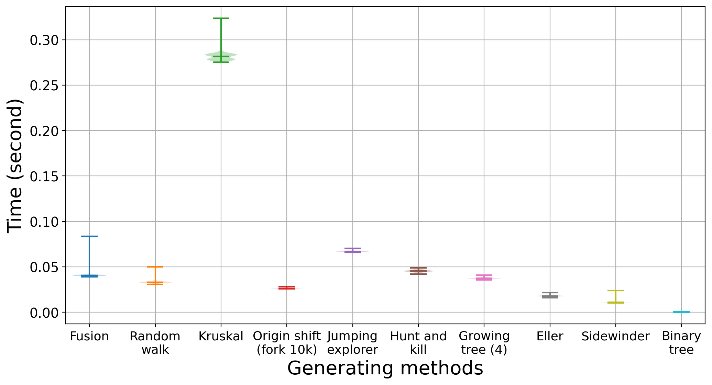
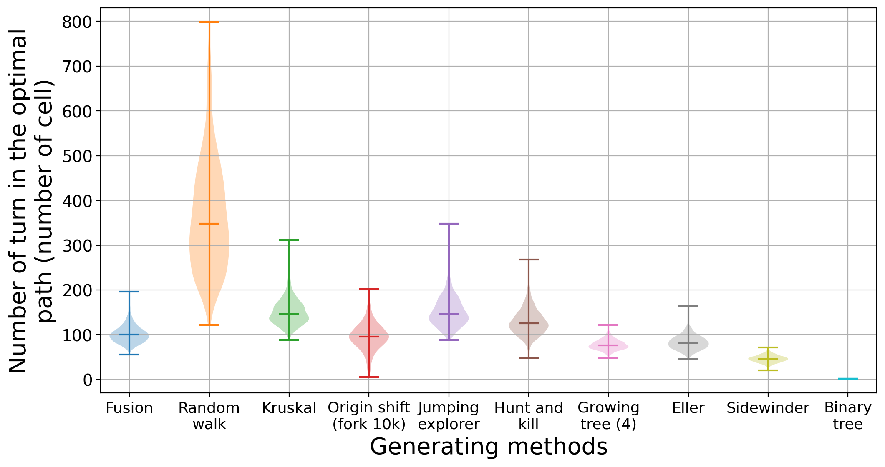

Here is an analysis of the generated mazes for the various algorithms.
The test was done by creating 1 000 random mazes for each method and 10 maze size.

## Time consumtion
To analyse the time consumtion to generate the maze was done by creating 1 000 random mazes for each method and eache maze size.

Time took to create maze depends of their size and of the algorithm as we can se on the figures below where we plot the natural logarithm of the median of the time to construct the labyrinth versus their size.

This figure contain one example of every algorithm for at leat one of their initialization and/or value of parameters. All algorithm shows an increasing trends with their size. At the exception of the binary tree, all method shows a logarithm trend pattern in this x-linear y-log space. The binary tree method seems to follow a linear trend and is in order of magnitude faster than all of the other methods. This comes from the indepent definition of the connections between the nods.

This figure shows the two possible initialisation of the origin shift algorithm for three number of iteration. The indication 1, 10 and 100 is the factor by wich the mazes is shuffled. The number of iteration is the factor times the the square of the width of the maze. The initialization does not seems to have any inmpact on the computational time as the curves are overlaping. Thanks to it simplicity within the shuffiling iterations, the increased computational time are mostly linear by the multiplicativ factor.

This figure shows ten possible values for the growing tree algorithm. All of the curve shows logarithm trend pattern, and are -at one execption- thightly packed together. The exception is the 1 growing step value, which is more time expensive than the other. We can also see that the curves show a subtle but systematic decrease in time consumption when increasing the number of growing step. This indicate that the part of growing branch is faster than the sampling part by a small margin.

This figure show the five possible initialisation for the binary tree algorithm. All curves -at the exception of the method without initialisation- shows clear logarithm trend pattern and are nerly ovelapping. This behavior difference is coming from the creation of the and not from their initialization. Indeed, I was not able yet to make the nodes connection indepandant as in the method without initialization. The logarithm trend pattern comes from the square augmentation of the number of nodes to visit.

The four next figures will show the distribution of time consumption for the 1 000 maze generation with 101 cells width.

This figure shows the distribution of time consumption for the 1 000 maze generation with 101 cells width for at leat one of their initialization and/or value of parameters. All algorithms display a gaussian to log-normal distribution. The slowest algorithm is the Kurskal method, followed by the fusion method. At the opposite, faster algorithm is the binary tree algorithm without initilization, followed the initilized binary tree and Sidewinder methods. It is worth to note that even the slowest iteration of Kurskal algorithm took less than 0.40 second to compute. The origin shift distribution shows that even being very simple, the amount of iteration for a factor of 10 make them slower than most of the other algorithm such as the random walking.

This figure shows the distribution of time consumption for the 1 000 maze generation with 101 cells width for the two possible initialisation of the origin shift algorithm for three number of iteration factor. Their time consumption does not completly follow the size of the iteration factor. With iteration for of 1, the took around 0.06 second to finish, around 0.09 for a factor of 10 and around 0.36 for 100. Using an iteration factor of 100 makes them nearly as slow as the Kurskal algorithm. 

This figure shows the distribution of time consumption for the 1 000 maze generation with 101 cells width for the ten possible values for the growing tree algorithm. Time consumption decrease logarimically as the number of random steps is increased. The width of the distribution increase with the augmentation of the number of random steps. Their distribution seems mostly gaussian.

This figure shows the distribution of time consumption for the 1 000 maze generation with 101 cells width for the five possible initialisation for the binary tree algorithm. The width distribution of the binary tree without initialization is nearly zero while the other ar around 0.02. Their distribution seem close to a log-normal with an queu in the high values. 

## Maze structure analysis

Length of the optimal path.

Number of turn in the optimal path.

Orientation of the connection of the cells.

Number of connection of the cells.

